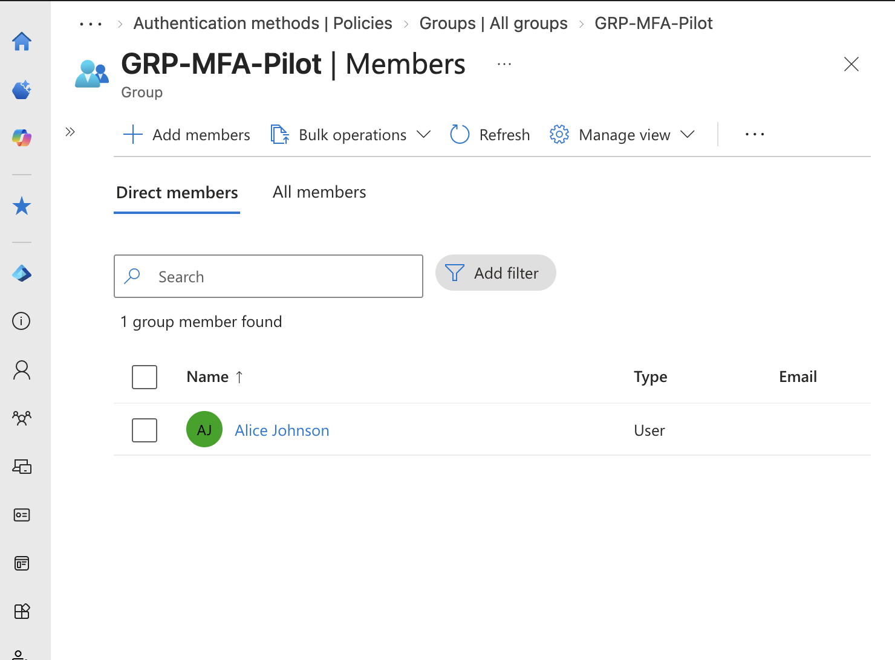
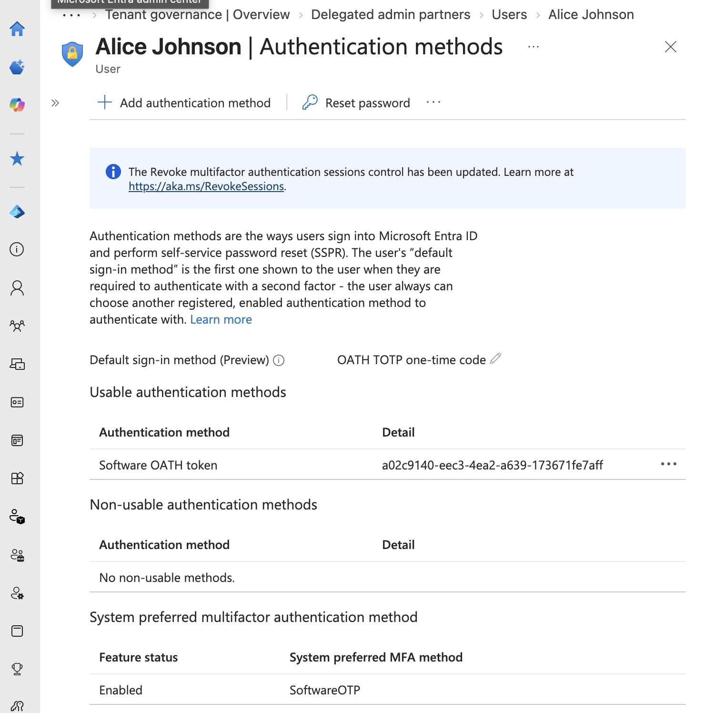
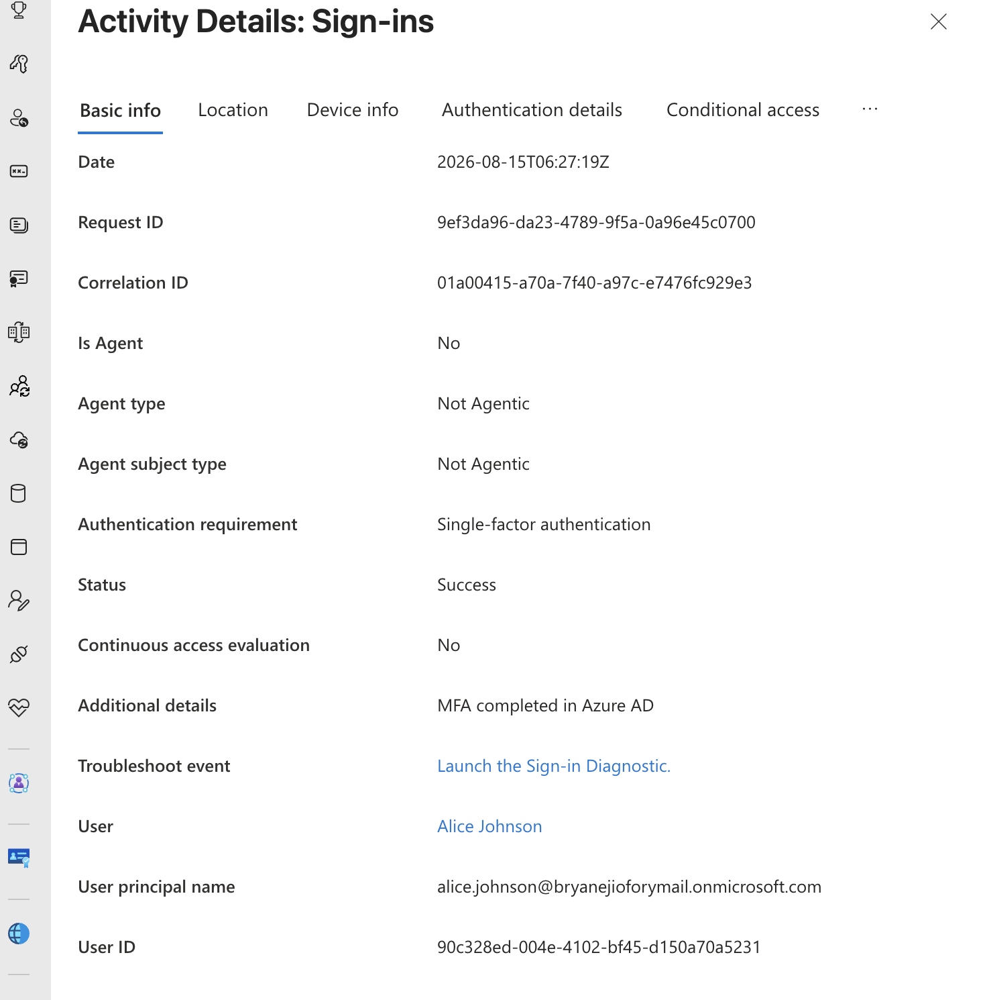

# Microsoft Entra ID — Authentication Methods & MFA Registration

## Project Overview

This lab explores authentication-method management in Microsoft Entra ID using a controlled pilot deployment.

The objective was to configure an MFA-capable authentication method for a test identity, observe the end-user registration process, 
and validate the resulting authentication behavior through Microsoft Entra sign-in logs.

The lab also demonstrates an important distinction between **registering an authentication method** and **enforcing multifactor authentication during sign-in**.

---

## Business Scenario

ChimaHealth Systems is preparing to strengthen authentication requirements for its workforce.

Before deploying authentication changes organization-wide, the IAM team must test the configuration with a limited population to:

* Validate the user registration experience
* Identify potential configuration issues
* Minimize the risk of organization-wide authentication disruption
* Verify authentication behavior before broader deployment

A dedicated pilot group was therefore created for authentication testing.

---

## Pilot Group

A security group named:

`GRP-MFA-Pilot`

was created to provide a controlled population for testing authentication-method configurations.

The fictional employee **Alice Johnson** was added as the initial pilot user.

This approach follows a controlled deployment model:

`Design → Pilot → Test → Validate → Expand`

Using a pilot population reduces the potential impact of configuration errors before authentication changes are deployed more broadly.

---

## Authentication Method Configuration

The Microsoft Entra Authentication Methods policy was reviewed to determine which authentication methods were available to the pilot user.

Microsoft Authenticator was targeted to the MFA pilot group.

During testing, third-party Software OATH authentication was also available to the user.

Alice registered a third-party authenticator application, which Microsoft Entra subsequently displayed as a:

`Software OATH token`

This demonstrated that Entra can support compatible time-based one-time password authentication applications in addition to Microsoft Authenticator.

---

## Authentication vs. Authorization

This lab reinforced the distinction between authentication and authorization.

**Authentication** verifies that a user is who they claim to be.

**Authorization** determines what an authenticated identity is permitted to access or perform.

Conceptually:

`Identity → Authentication → Authorization → Resource`

Authentication must occur before the system can make access decisions based on the user's permissions.

---

## Authentication Method Registration

Alice initially signed in using a temporary password.

During the first sign-in:

1. Alice was required to change the temporary password.
2. Alice was prompted to register an authentication method.
3. A third-party authenticator application was selected.
4. The authenticator was successfully registered.
5. Microsoft Entra recorded the method as a Software OATH token.

The registered authentication method was then verified through Alice's Entra user object.

---

## Authentication Testing

After registration was completed, a new private browser session was used to perform a fresh sign-in as Alice.

### Expected Security Objective

The desired future security state is:

`Password + Additional Factor → Access`

### Observed Result

Alice was able to authenticate using:

`Password → Access`

The registered Software OATH token was not required during this authentication event.

---

## Sign-In Log Analysis

Microsoft Entra sign-in logs were reviewed to validate the authentication result.

The successful sign-in showed:

**Authentication Requirement:** `Single-factor authentication`

This confirmed that although Alice had an MFA-capable authentication method registered, the tested sign-in did not require multifactor authentication.

---

## Key Finding

This lab demonstrated that:

> **Authentication-method registration does not automatically mean that multifactor authentication is enforced for every sign-in.**

The Authentication Methods policy controls which authentication methods are available to users.

A separate authentication or access policy can determine when stronger authentication must actually be satisfied.

The environment therefore had an MFA-capable method available and registered, but the tested authentication event still required only a single factor.

---

## Security Gap Identified

### Current State

`Alice → Password → Successful Authentication`

### Available Authentication Capability

`Alice → Password + Software OATH`

### Problem

The additional authentication method existed but was not required during the tested sign-in.

Therefore, the existence of the authentication method alone did not provide the intended MFA enforcement for that authentication event.

---

## Recommended Remediation

The next phase of the IAM implementation will use **Microsoft Entra Conditional Access** to enforce multifactor authentication requirements for the pilot population.

The proposed control will follow the model:

`IF user belongs to GRP-MFA-Pilot`

`AND user accesses targeted cloud resources`

`THEN require multifactor authentication`

The policy will initially be tested against the pilot population before broader deployment.

---

## Security Principles Demonstrated

### Controlled Deployment

Authentication changes were tested against a limited pilot group rather than immediately deployed to the entire organization.

### Authentication Method Governance

Available authentication methods were reviewed and targeted according to the test population.

### Validation Through Logging

Authentication behavior was verified using Microsoft Entra sign-in logs rather than assuming the configuration produced the intended security outcome.

### Configuration vs. Effective Control

The lab demonstrated that having an MFA-capable method configured does not necessarily mean MFA is being enforced.

Security controls should be tested to confirm their actual behavior.

---

## Evidence

### MFA Pilot Group

The pilot security group contains the test identity used for authentication testing.

### Registered Software OATH Method

Microsoft Entra displays the third-party authenticator registration as a Software OATH token.

### Single-Factor Authentication Baseline

The sign-in logs confirmed that the tested authentication event required only single-factor authentication.

---

## Lessons Learned

Complete this section in your own words.
- In testing the configuration as the end user, I learned that simply registering an authentication method is different from MFA enforcement.
  An authentication method can be registered and available to a user without any particular sign in requiring MFA.
- I also learned how to gather information from sign in logs, like authentication type, conditional access and MFA if enabled.
- When MFA capable methods are registered but not required, resources are vulnerable to attacks like phishing

Consider:

* Why authentication-method registration and MFA enforcement are different
* Why authentication changes should be tested with a pilot group
* Why sign-in logs are important when validating IAM controls
* What security risk exists when MFA-capable methods are registered but not required
* What you learned from testing the configuration as the end user instead of only viewing the administrator configuration

---

## Next Steps

The next lab will implement **Microsoft Entra Conditional Access** to remediate the authentication gap identified during testing.

The objective will be to move the pilot identity from:

`Single-Factor Authentication`

to:

`Multifactor Authentication`

and verify the result through Microsoft Entra sign-in logs.
