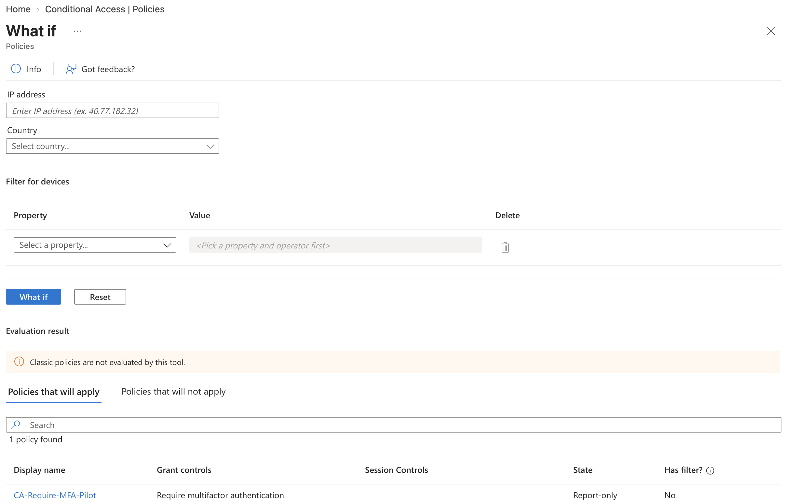
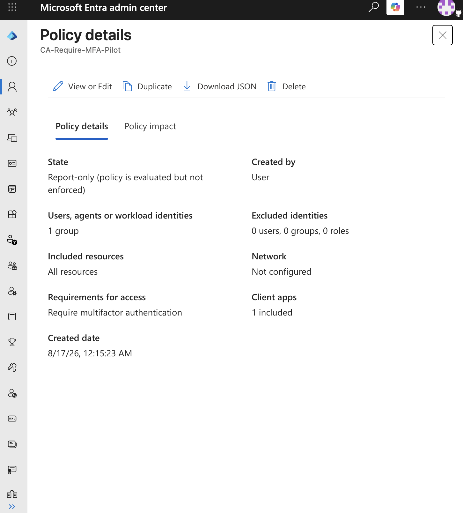
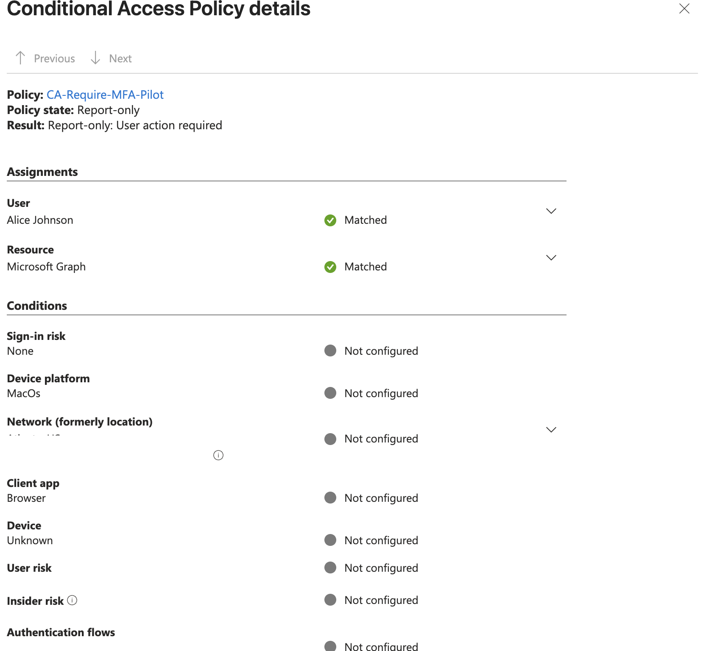
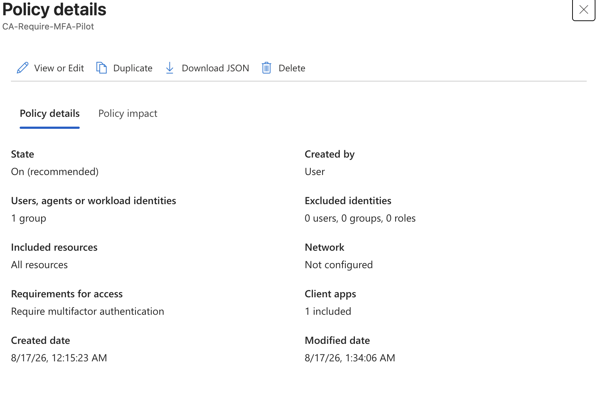
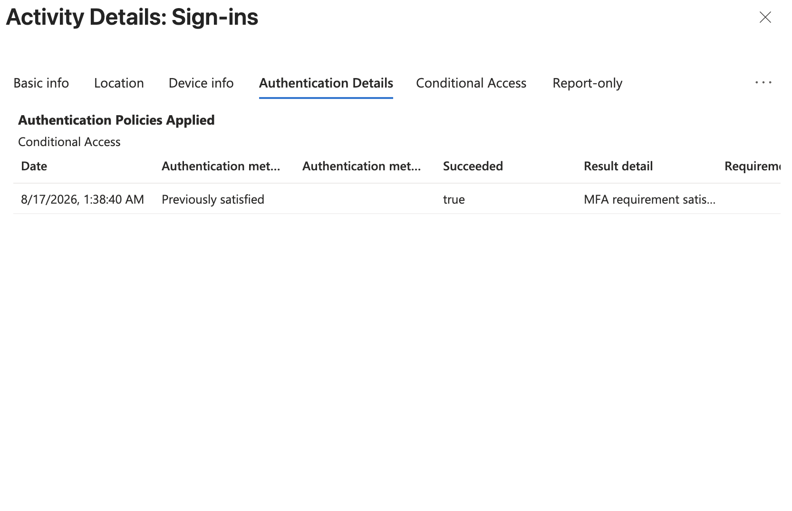
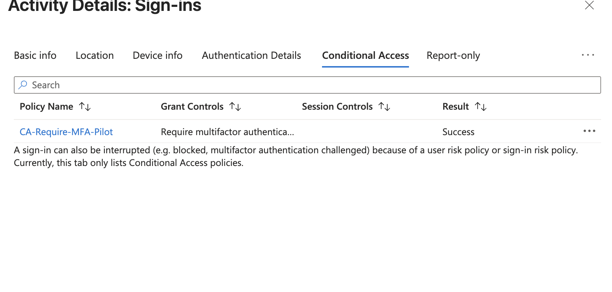

# Microsoft Entra ID — Conditional Access MFA Enforcement

## Project Overview

This lab demonstrates the design, testing, implementation, and validation of a Microsoft Entra Conditional Access policy used to enforce multifactor authentication.

The project builds upon the authentication testing performed in Lab 02, where a test user had an MFA-capable authentication method registered but was still able to authenticate using only a password.

The objective of this lab was to remediate that security gap using Conditional Access and verify the effectiveness of the control through Microsoft Entra sign-in logs.

---

## Business Scenario

ChimaHealth Systems requires members of its MFA pilot population to perform multifactor authentication when accessing company cloud resources.

Previous authentication testing identified that the pilot user had a Software OATH authentication method registered but was not required to use it during a subsequent sign-in.

Microsoft Entra sign-in logs confirmed:

**Authentication requirement: Single-factor authentication**

The IAM team therefore needed to implement an access policy that actively required MFA.

---

## Security Gap

### Existing Configuration

The pilot user had:

* A password
* A registered Software OATH token
* Membership in `GRP-MFA-Pilot`

However, testing demonstrated:

`Password → Successful Authentication`

The existence of an MFA-capable authentication method did not automatically enforce MFA.

### Desired State

The required authentication flow was:

`Password → MFA Requirement → Additional Factor → Access`

---

## Conditional Access Policy Design

A Conditional Access policy was created:

`CA-Require-MFA-Pilot`

The policy was configured as follows:

| Configuration         | Value                              |
| --------------------- | ---------------------------------- |
| Users/Groups          | `GRP-MFA-Pilot`                    |
| Target Resources      | All resources                      |
| Additional Conditions | None                               |
| Grant Control         | Require multifactor authentication |
| Initial State         | Report-only                        |

The policy was intentionally scoped to the pilot group rather than deployed organization-wide.

This reduced the potential impact of configuration errors during testing.

---

## Conditional Access Logic

The policy can be represented as:

```text
IF

User is a member of GRP-MFA-Pilot

AND

User accesses a targeted cloud resource

THEN

Grant access

ONLY IF

Multifactor authentication is satisfied
```

---

## What If Validation

Before enforcing the policy, the Microsoft Entra **What If** tool was used to simulate Conditional Access evaluation for the pilot user.

The simulation showed:

`CA-Require-MFA-Pilot`

under the policies that would apply.

This provided an initial validation that the intended user and resource scope matched the policy.



---

## Report-Only Deployment

The policy was initially deployed in:

**Report-only**

Report-only mode allowed Conditional Access to evaluate the policy during actual sign-ins without enforcing the MFA requirement.

This followed the deployment model:

`Design → Simulate → Report-only → Validate → Enforce`



---

## Report-Only Sign-In Testing

A fresh sign-in was performed using the pilot identity.

Because the Conditional Access policy was still in Report-only mode, the user was not prevented from continuing based on the new policy.

The resulting Conditional Access evaluation showed:

**Report-only: User action required**

This demonstrated that:

1. The user matched the policy scope.
2. The targeted resource matched the policy.
3. MFA would be required if the policy were enforced.



---

## Policy Enforcement

After validating the expected policy behavior, `CA-Require-MFA-Pilot` was changed from:

`Report-only`

to:

`On`

The policy now actively enforced the MFA grant control for the pilot population.



---

## MFA Validation

A new private browser session was used to perform another authentication test.

Unlike the baseline test from Lab 02, the user was now required to satisfy multifactor authentication.

The authentication flow became:

```text
Alice Johnson
      ↓
Password
      ↓
Conditional Access Evaluation
      ↓
CA-Require-MFA-Pilot
      ↓
MFA Required
      ↓
Software OATH
      ↓
Authentication Successful
```

Microsoft Entra Authentication Details confirmed that the MFA authentication step:

**Succeeded: True**



---

## Conditional Access Validation

The resulting sign-in event was also reviewed under the Conditional Access details.

The policy:

`CA-Require-MFA-Pilot`

reported:

**Success**

This confirmed that the Conditional Access policy applied and its access requirements were successfully satisfied.



---

## Before vs. After

### Before Conditional Access

Lab 02 established the authentication baseline:

```text
Password
   ↓
Single-factor authentication
   ↓
Access
```

The user possessed an MFA-capable method, but MFA was not required.

### After Conditional Access

Lab 03 changed the effective authentication requirement:

```text
Password
   ↓
Conditional Access
   ↓
MFA Required
   ↓
Software OATH
   ↓
Multifactor Authentication
   ↓
Access
```

This demonstrates the distinction between **authentication-method registration** and **authentication-policy enforcement**.

---

## Security Principles Demonstrated

### Conditional Access

Access requirements were dynamically enforced through Microsoft Entra Conditional Access.

### Multifactor Authentication

Access required an additional authentication factor rather than relying solely on a password.

### Controlled Deployment

The policy was scoped to a pilot group before any consideration of broader deployment.

### Report-Only Testing

Policy impact was evaluated before enforcement to reduce the risk of unintended access disruption.

### Policy Simulation

The What If tool was used to determine whether the intended Conditional Access policy would apply to the test scenario.

### Security Control Validation

The implementation was validated through actual authentication testing and sign-in telemetry rather than relying solely on policy configuration.

---

## Lessons Learned

- I learnt of the massive contribution what if tool contributes to policy testing. With the tool I was able to test the behavior of the policy       without disrupting the user's flow.
- In the same breadth the report only was valuable and I learnt how to use it to observe a policy behavior before it is deployed, also the          importance and usefulness of deploying to pilot groups to reduce operational risk
- This lab reinforced the importance of sign in logs and how necessary they are for validating the effectiveness of IAM controls providing basic    info as well as conditional access and authentication details. 

---

## Security Considerations

Conditional Access policies can potentially prevent users or administrators from accessing organizational resources if configured incorrectly.

For this lab:

* The policy was limited to a dedicated test group.
* The administrative account was kept outside the pilot group.
* The policy was tested in Report-only mode before enforcement.
* Sign-in logs were reviewed before and after activation.
* Sensitive account, authentication, network, and tenant information was excluded or redacted from public documentation.

Production environments should additionally maintain appropriate emergency-access procedures and accounts.

---

## Outcome

The project successfully changed the pilot user's authentication requirement from:

**Single-factor authentication**

to:

**Multifactor authentication**

using Microsoft Entra Conditional Access.

The implementation was validated through both Conditional Access results and authentication telemetry.

---

## Next Steps

Future Conditional Access labs will explore more granular access decisions involving:

* Authentication strengths
* Phishing-resistant authentication
* Device state
* Network/location conditions
* Application-specific access requirements
* Administrative identities
* Risk-based access policies
