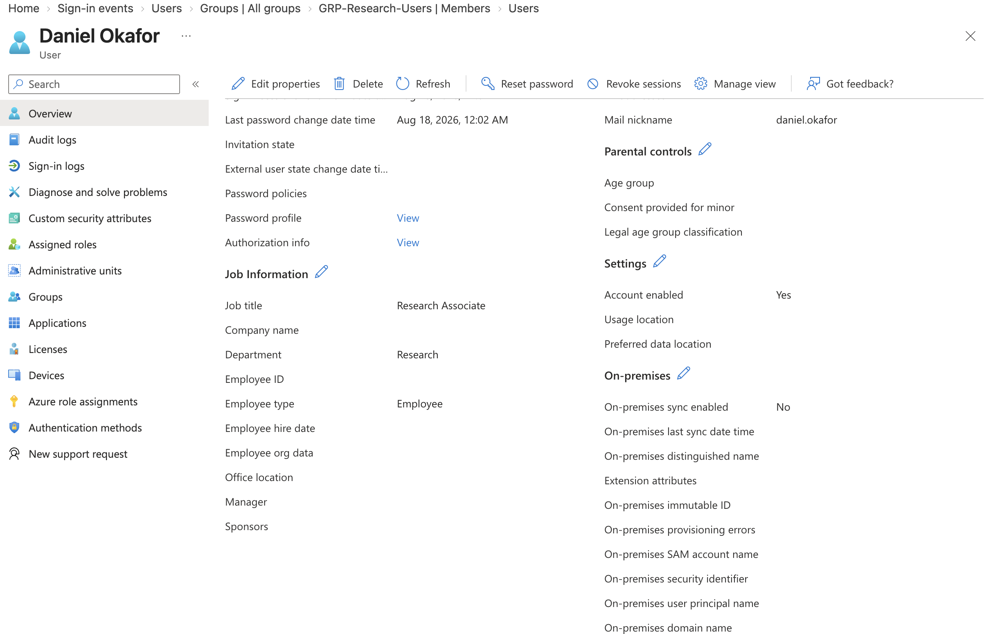
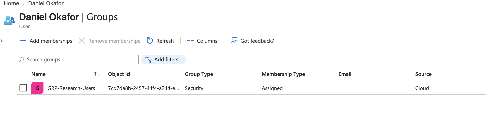
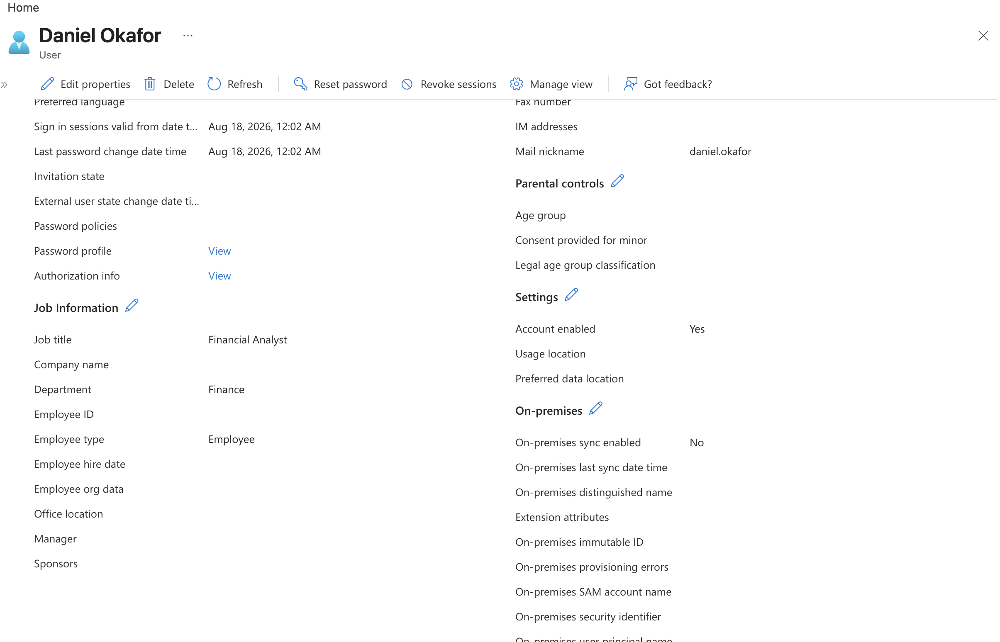
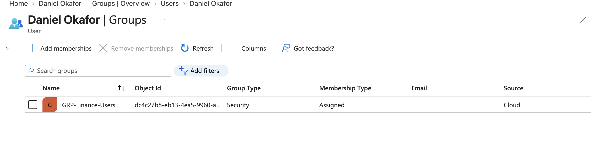
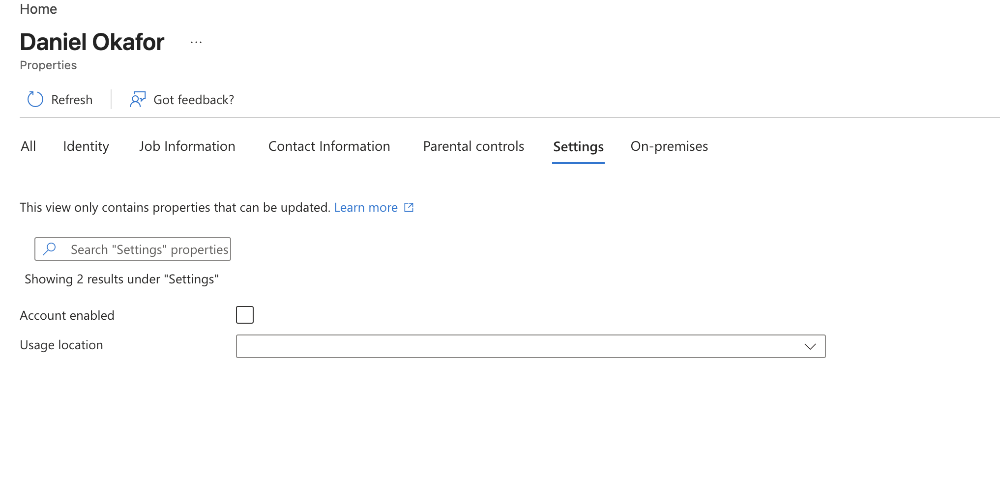
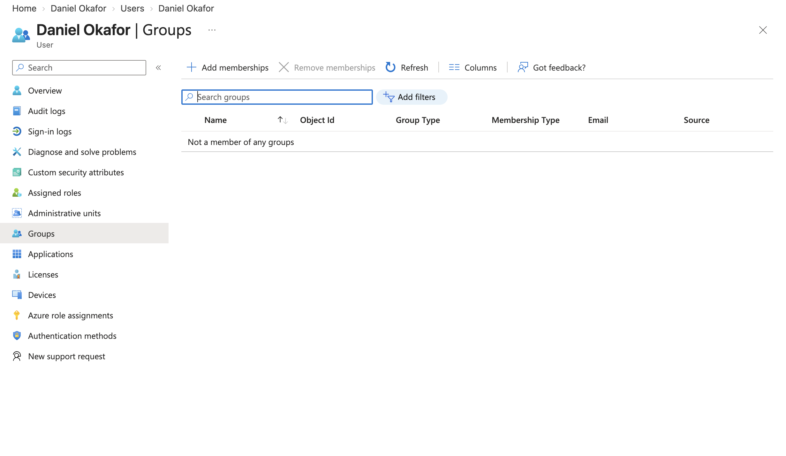
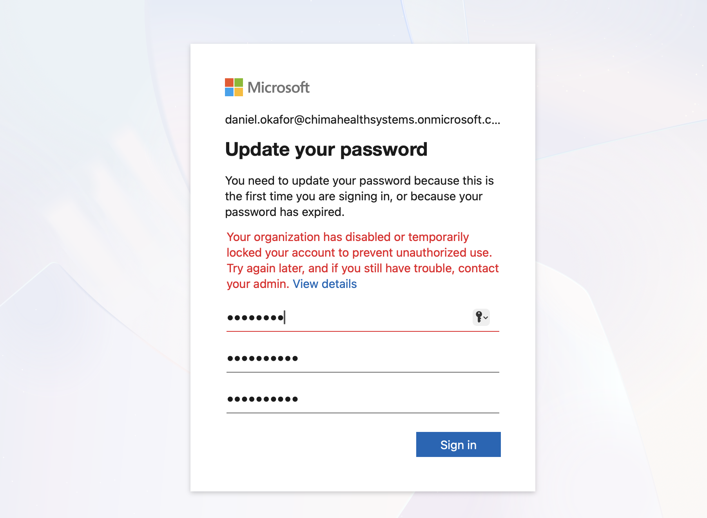
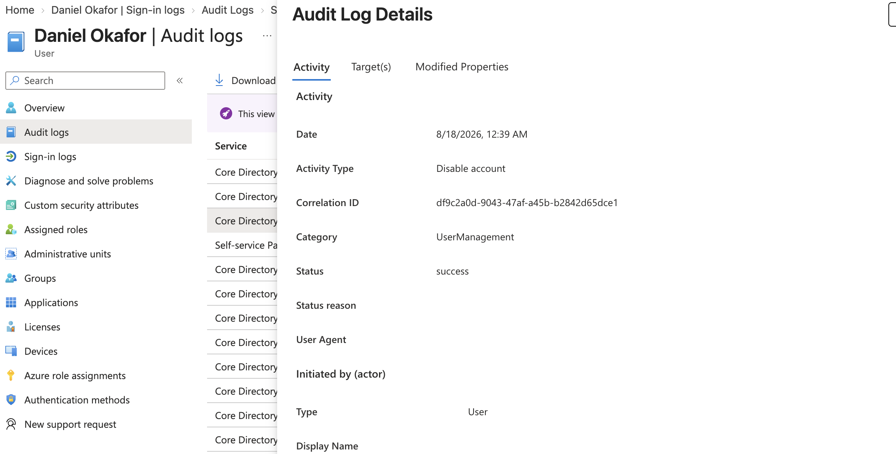

# Microsoft Entra ID — Joiner, Mover & Leaver Identity Lifecycle Management

## Project Overview

This lab demonstrates a complete **Joiner-Mover-Leaver (JML)** identity lifecycle using Microsoft Entra ID.

The project follows a fictional ChimaHealth Systems employee through three employment events:

1. **Joiner** — onboarding into the Research department
2. **Mover** — transfer from Research to Finance
3. **Leaver** — termination and access revocation

The objective was to demonstrate how identity attributes, group memberships, authentication status, active sessions, and access rights should change as an employee moves through the organizational lifecycle.

---

## Business Scenario

ChimaHealth Systems requires an Identity and Access Management process capable of responding to changes in employee status.

IAM must ensure that:

* New employees receive appropriate access when they join.
* Employees changing roles receive access appropriate to their new responsibilities.
* Access associated with previous responsibilities is removed.
* Terminated employees can no longer authenticate or retain business access.
* Administrative changes remain available for auditing and investigation.

A fictional employee, **Daniel Okafor**, was used to demonstrate the lifecycle.

---

# JML Architecture

```text
                         HR EVENT
                            |
                            v
                    Identity Lifecycle
                            |
          +-----------------+-----------------+
          |                 |                 |
          v                 v                 v
       JOINER             MOVER             LEAVER
          |                 |                 |
     Create User       Update Identity    Block Sign-In
          |                 |                 |
     Set Attributes     Remove Old Access  Revoke Sessions
          |                 |                 |
     Assign Group       Add New Access     Remove Access
          |                 |                 |
       Validate            Validate          Validate
          |                 |                 |
          +-----------------+-----------------+
                            |
                            v
                       Audit Trail
```

---

# Phase 1 — Joiner

## HR Event

Daniel joined ChimaHealth Systems with the following employment information:

| Attribute           | Value              |
| ------------------- | ------------------ |
| Employee            | Daniel Okafor      |
| Department          | Research           |
| Job Title           | Research Associate |
| Employee Type       | Employee           |
| Administrative Role | None               |

The HR event was translated into an identity provisioning requirement.

---

## Identity Provisioning

A new Microsoft Entra user identity was created for Daniel.

Organizational attributes were populated to represent his business role:

* Department: `Research`
* Job title: `Research Associate`
* Employee type: `Employee`

No privileged administrative role was assigned because Daniel's position did not require administrative access.

This follows the **principle of least privilege**.

### Evidence



---

## Initial Access Provisioning

Daniel required baseline access associated with his Research role.

Rather than assigning access directly to the individual identity, Daniel was added to:

`GRP-Research-Users`

The access model was therefore:

```text
Daniel Okafor
      |
      v
GRP-Research-Users
      |
      v
Research Resources
```

Group-based access provides a more scalable mechanism for provisioning and revoking access than individually assigning resources to employees.

### Evidence



---

# Phase 2 — Mover

## HR Transfer Event

Daniel later transferred from Research to Finance.

His new employment information became:

| Attribute       | Previous           | New                |
| --------------- | ------------------ | ------------------ |
| Department      | Research           | Finance            |
| Job Title       | Research Associate | Financial Analyst  |
| Research Access | Required           | No longer required |
| Finance Access  | Not required       | Required           |

This event required both **provisioning new access and revoking obsolete access**.

---

## Identity Attribute Update

Daniel's Entra identity was updated to reflect his new organizational position:

`Department: Finance`

`Job Title: Financial Analyst`

### Evidence



---

## Access Reconciliation

Simply adding Finance access would have created an access-control problem.

An incomplete Mover process could result in:

```text
Daniel
   |
   +---- Research Access
   |
   +---- Finance Access
```

even though Research access was no longer required.

This creates **access accumulation**, commonly referred to as privilege creep.

Instead, the following changes were performed:

**Removed:**

`GRP-Research-Users`

**Added:**

`GRP-Finance-Users`

The resulting access model became:

```text
BEFORE

Daniel
   |
   v
Research
   |
   v
GRP-Research-Users


AFTER

Daniel
   |
   v
Finance
   |
   v
GRP-Finance-Users
```

### Evidence



---

## Mover Security Principle

The Mover process demonstrated that granting new access is only one half of an identity transition.

Obsolete access must also be reviewed and removed.

Otherwise, employees can accumulate permissions as they move through an organization.

The desired principle is:

> Access should reflect the user's **current business responsibilities**, not every responsibility the user has held historically.

This supports both **least privilege** and effective access governance.

---

# Phase 3 — Leaver

## Termination Event

Daniel subsequently left ChimaHealth Systems.

The IAM requirement changed from providing appropriate access to **terminating access while retaining the identity record**.

The offboarding process followed this sequence:

```text
Termination Event
       |
       v
Block Authentication
       |
       v
Revoke Sessions
       |
       v
Remove Business Access
       |
       v
Validate
       |
       v
Retain Identity
```

The user object was intentionally **not immediately deleted**.

---

## Account Disablement

Daniel's Entra account was disabled to prevent future authentication.

This separated two lifecycle concepts:

**Disable identity**

versus

**Delete identity**

Immediate deletion may not always be appropriate because organizations can have requirements involving auditability, investigations, data ownership, retention, or recovery.

The identity was therefore retained while authentication was blocked.

### Evidence



---

## Session Revocation

Blocking future authentication does not necessarily address sessions established before the termination event.

Daniel's active sessions were therefore revoked as part of the offboarding process.

The security objective was to address both:

```text
NEW AUTHENTICATION
       |
       v
Account Disabled


EXISTING AUTHENTICATION
       |
       v
Sessions Revoked
```

This reduces the possibility that previously established authenticated sessions continue to provide access after termination.

---

## Business Access Removal

Daniel was removed from:

`GRP-Finance-Users`

This removed the business access associated with his most recent Finance position.

The resulting offboarding state was:

```text
Daniel Okafor
      |
      +---- Account Disabled
      |
      +---- Sessions Revoked
      |
      +---- Finance Membership Removed
      |
      +---- Administrative Roles: None
      |
      +---- Identity Retained
```

### Evidence



---

# Authentication Validation

After disabling Daniel's account, a new authentication attempt was performed.

The sign-in attempt did not complete successfully.

However, the captured sign-in event reported:

`AADSTS50055 — Password expired`

rather than producing a disabled-account-specific error.

Because the expired-password condition was surfaced during the authentication attempt, the failed sign-in is **not being used as the primary evidence of account disablement**.

Account disablement was instead verified directly through the Entra user state and administrative audit records.

This distinction is important because security validation should report what telemetry actually demonstrates rather than assuming the cause of a failed authentication.

### Evidence



---

# Audit Validation

Microsoft Entra audit logs were reviewed following the lifecycle operations.

Recorded administrative activities included events associated with:

* Adding the user
* Updating the user
* Adding group membership
* Changing group membership
* Disabling the account

Audit telemetry provides evidence of **administrative changes to identity objects**, while sign-in logs provide evidence of **authentication activity**.

Conceptually:

```text
SIGN-IN LOGS

Who attempted to authenticate?
Was authentication successful?
Why did authentication fail?


AUDIT LOGS

What identity configuration changed?
Who initiated the change?
What object was affected?
When did the change occur?
```

### Evidence



---

# Complete Identity Lifecycle

The final lifecycle can be represented as:

```text
                         Daniel Okafor
                              |
              +---------------+---------------+
              |               |               |
              v               v               v

           JOINER           MOVER           LEAVER
              |               |               |
          Research          Finance        Terminated
              |               |               |
        Research Group   Remove Research   Disable Account
                              |
                         Finance Group     Revoke Sessions
                                              |
                                         Remove Finance
                                              |
                                         Retain Identity
```

---

# Security Principles Demonstrated

## Least Privilege

Daniel received only the access required for his current business responsibilities.

No administrative roles were assigned because his job did not require privileged access.

## Group-Based Access Management

Departmental access was represented through security-group membership rather than unmanaged individual access assignments.

## Privilege Creep Prevention

Research access was removed when Daniel transferred to Finance rather than allowing obsolete access to accumulate.

## Access Revocation

Termination addressed authentication, existing sessions, and authorization rather than relying on a single control.

## Identity Retention

The terminated identity was disabled rather than immediately deleted, preserving the identity object for potential audit, retention, investigation, or recovery requirements.

## Auditability

Administrative actions were reviewed through Entra audit logs to establish evidence of lifecycle changes.

## Security Control Validation

Identity changes were validated through user state, group membership, authentication attempts, sign-in telemetry, and audit records rather than assuming configuration changes had the intended effect.

---

# Manual vs. Automated Lifecycle Management

This lab intentionally performed the lifecycle manually to demonstrate the underlying IAM process.

The workflow was:

```text
HR Event
   |
   v
IAM Administrator
   |
   v
Microsoft Entra ID
   |
   +---- Identity Attributes
   |
   +---- Group Membership
   |
   +---- Authentication State
   |
   +---- Session State
```

Although appropriate for learning, manual lifecycle management becomes difficult at enterprise scale.

Potential challenges include:

* Delayed provisioning
* Inconsistent access assignments
* Failure to remove obsolete access
* Human error
* Slow termination processing
* Limited scalability

A more mature environment can move toward:

```text
Authoritative HR Source
          |
          v
Lifecycle Trigger
          |
          v
Identity Automation
          |
          v
Microsoft Entra ID
          |
    +-----+-----+
    |           |
    v           v
 Groups     Applications
```

Future portfolio labs will build toward identity governance and automation.

---

# Lessons Learned
- Removing old access is just as important as granting new access.
  It is important to avoid privilege creep and make sure users only have the necessary access needed for their job.
- Sign in logs shows who tried to access, while audit logs shows who changes something.
- The JML process for a large organization will be significantly slow if handled manually, hence need for automation.

---

# Outcome

This project demonstrated the complete identity lifecycle of a simulated employee in Microsoft Entra ID:

**Joiner**

`HR Hire → Identity Created → Attributes Assigned → Research Access Provisioned`

**Mover**

`Department Change → Attributes Updated → Research Access Revoked → Finance Access Provisioned`

**Leaver**

`Termination → Account Disabled → Sessions Revoked → Finance Access Removed → Identity Retained`

The project demonstrates how effective IAM requires continuous alignment between an identity's **current business role and its current access**.
